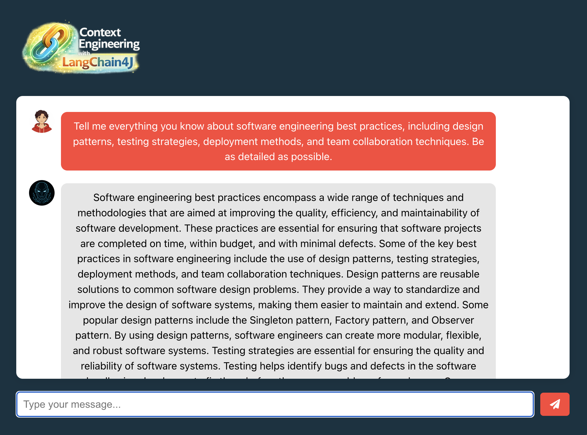
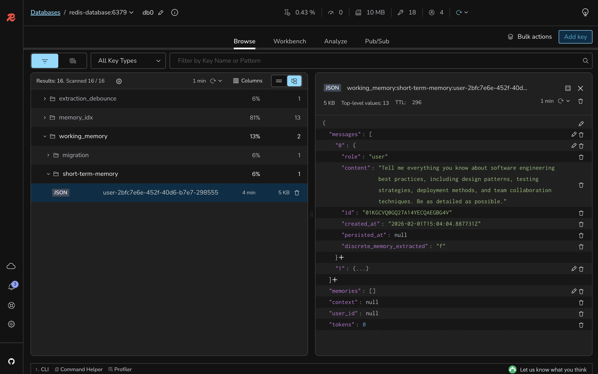

# Lab 8: Enabling Token Management to Handle Token Limits

## 🎯 Learning Objectives

By the end of this lab, you will:
- Implement token window management for context optimization
- Configure dynamic message pruning based on token limits
- Use OpenAI token count estimation for accurate measurement
- Handle long conversations within model constraints
- Test token overflow scenarios and automatic pruning

#### 🕗 Estimated Time: 10 minutes

## 🏗️ What You're Building

In this lab, you'll implement token management to ensure your application handles context window limits effectively, maintaining conversation quality even in lengthy exchanges. This includes:

- **Token Window Management**: Automatic pruning of older messages
- **Token Count Estimation**: Accurate measurement of context size
- **Dynamic Context Adjustment**: Keeping most relevant messages within limits
- **Overflow Handling**: Graceful degradation when approaching limits

### Architecture Overview

```
┌─────────────┐     ┌────────────────—──┐     ┌─────────────——┐
│  Frontend   │────▶│  Spring Boot API  │────▶│    OpenAI     │
│  (Node.js)  │     │   + LangChain4J   │     │ GPT-3.5 Turbo │
└─────────────┘     │  + Token Manager  │     └────────────——─┘
                    └─────────────────—─┘
                             │
                    ┌────────────────────┐
                    │  Token Window      │
                    │   Management       │
                    └────────────────────┘
                             │
                    ┌────────┴───────────┐
                    ▼                    ▼
            [Current Context]    [Token Counter]
                    │                    │
                    ▼                    ▼
            [Within Limits?]      [Estimate Size]
                    │                    │
                    ▼                    ▼
            [Prune if Needed]    [Keep Recent]
```

## 📋 Prerequisites Check

Before starting, ensure you have:

- [ ] Completed Lab 7 successfully
- [ ] Few-shot learning system prompt in place
- [ ] Understanding of token limits (GPT-3.5: 4096 tokens)
- [ ] Redis Agent Memory Server running

## 🚀 Setup Instructions

### Step 1: Switch to the Lab 8 Branch

```bash
git checkout lab-8-starter
```

### Step 2: Review Token Configuration

Open `backend-layer/src/main/java/io/redis/devrel/workshop/memory/ShortTermMemory.java` and review the token-related configuration:

```java
@Value("${langchain4j.open-ai.streaming-chat-model.model-name}")
private String modelName;

@Value("${chat.memory.max.tokens}")
private int maxTokens;
```

### Step 3: Implement Token Window Chat Memory

In `ShortTermMemory.java`, update the `chatMemory()` method to use token-based memory management.

Change from this:

```java
@Bean
public ChatMemory chatMemory(ChatMemoryStore chatMemoryStore) {
    return WorkingMemoryChat.builder()
            .id(userId)
            .chatMemoryStore(chatMemoryStore)
            .build();
}
```

To this:

```java
@Bean
public ChatMemory chatMemory(ChatMemoryStore chatMemoryStore) {
    return TokenWindowChatMemory.builder()
            .id(userId)
            .chatMemoryStore(chatMemoryStore)
            .maxTokens(maxTokens, new OpenAiTokenCountEstimator(modelName))
            .build();
}
```

### Step 4: Configure Token Limits

Include the following property to your `.env` file:

```bash
CHAT_MEMORY_MAX_TOKENS=768
```

The `max-tokens` value of `768` is very low for production environments but is suitable for testing token management behavior. This will give you a good testing experience so you won't have to create lenghty conversations with the AI to see the message pruning in action.
 
### Step 5: Rebuild and Run the Backend

```bash
cd backend-layer
mvn clean package
mvn spring-boot:run
```

### Step 6: Keep the Frontend Running

The frontend should still be running. If not:

```bash
cd frontend-layer
npm start
```

## 🧪 Testing Token Management

### Test Token Window Behavior

1. Open http://localhost:3000 in your browser
2. Have a long conversation (1-5 messages)
3. Notice older messages being automatically pruned
4. Verify recent context is preserved

Example long message test:
```
Tell me everything you know about software engineering best practices,
including design patterns, testing strategies, deployment methods,
and team collaboration techniques. Be as detailed as possible.
```



With Redis Insight, you will see a couple of messages there:



### Verify Context Preservation

Using RedisInsight:
1. Check the working memory before token limit
2. Send more messages to exceed the limit
3. Verify older messages are removed
4. Confirm recent messages remain


### Test with Different Token Limits

Temporarily adjust `CHAT_MEMORY_MAX_TOKENS` in .env:
- Try 100 tokens (more aggressive pruning)
- Try 3000 tokens (less frequent pruning)
- Observe behavior differences

## 🎨 Understanding the Code

### 1. `TokenWindowChatMemory`
- Maintains conversation within token limits
- Automatically removes oldest messages when limit approached
- Preserves most recent and relevant context
- Uses sliding window approach

### 2. `OpenAiTokenCountEstimator`
- Accurately estimates tokens for OpenAI models
- Accounts for special tokens and formatting
- Model-specific tokenization rules
- Helps prevent context overflow

### 3. Token Budget Allocation
- **System Prompt**: ~500 tokens (including few-shot)
- **Chat History**: 2000 tokens (configured limit)
- **Retrieved Context**: ~500 tokens (from RAG)
- **Response Space**: ~1000 tokens
- **Total**: Within 4096 token limit

### 4. Pruning Strategy
- First-In-First-Out (FIFO) approach
- Removes complete message pairs (user + assistant)
- Maintains conversation coherence
- Keeps most recent exchanges

## 🔍 What's Still Missing? (Context Engineering Perspective)

Your application now has token management, but still lacks:
- ❌ **No Semantic Caching**: Redundant queries still hit LLM

**The final lab will add this last optimization!**

## 🐛 Troubleshooting

### Common Issues and Solutions

<details>
<summary>Messages disappearing too quickly</summary>

Solution:
- Increase max-tokens value in application.properties
- Check if messages are unusually long
- Verify token estimation is accurate
- Consider using a model with larger context window
</details>

<details>
<summary>Token limit exceeded errors</summary>

Solution:
- Reduce max-tokens to leave more buffer
- Check total of all token consumers
- Monitor actual token usage
- Adjust system prompt length if needed
</details>

<details>
<summary>Conversation losing important context</summary>

Solution:
- Store critical information in long-term memory
- Adjust token window size
- Consider message importance weighting
- Use summary techniques for older messages
</details>

## 🎉 Lab Completion

Congratulations! You've successfully:
- ✅ Implemented token window management
- ✅ Configured automatic message pruning
- ✅ Added token count estimation
- ✅ Handled long conversations within limits

## 📚 Additional Resources

- [Understanding Tokenization](https://platform.openai.com/tokenizer)
- [LangChain4J Token Management](https://docs.langchain4j.dev/tutorials/chat-memory#token-window-chat-memory)
- [OpenAI Model Limits](https://platform.openai.com/docs/models)
- [Context Window Strategies](https://www.pinecone.io/learn/context-window/)

## ➡️ Next Steps

You're ready for [Lab 9: Implementing Semantic Caching for Conversations](../lab-9-starter/README.md) where you'll add the final optimization - semantic caching to reduce redundant LLM calls.

```bash
git checkout lab-9-starter
```